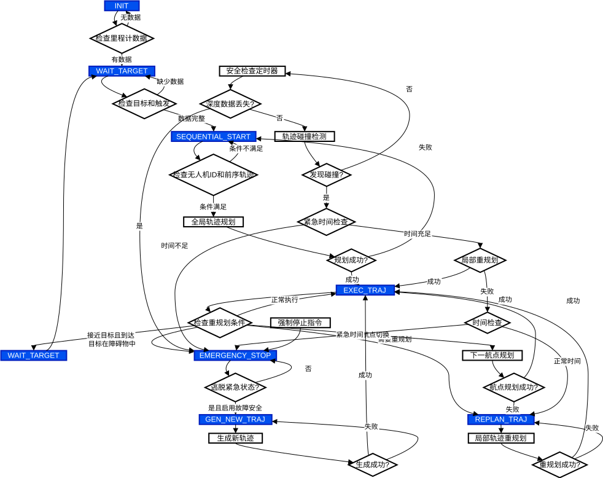
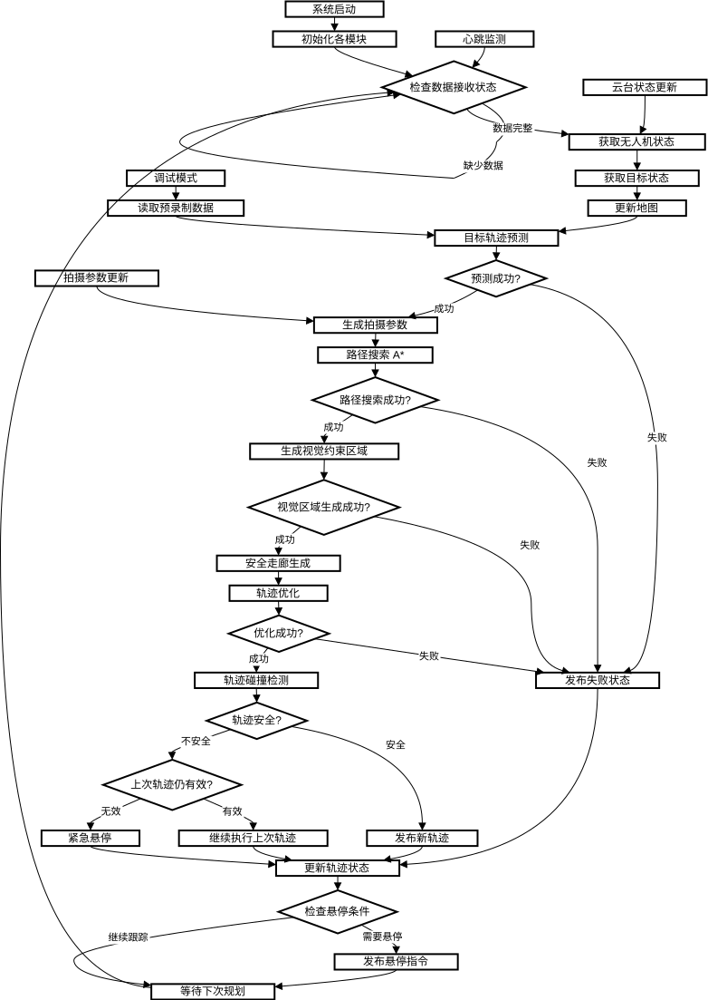
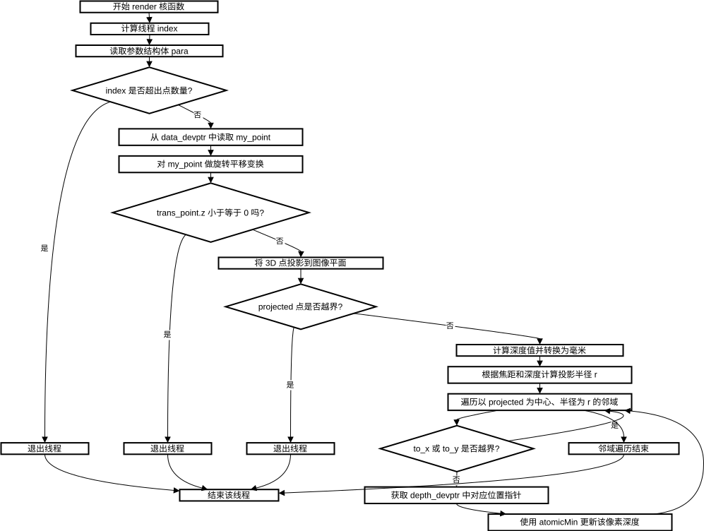

# 代码笔记

## 1. 目录结构
`tree -L 4 src`

```text
src
|-- auto-filmer
|   |-- mapping
|   |   |-- config # 相机内外参，rviz参数
|   |   |-- include # 点云缓存数据结构
|   |   |-- launch 启动nodelet manager，mapping和rviz
|   |   `-- src 
|   |       |-- mapping.cc mapping # 算法，读取depth/global_map
|   |       |-- mapping_nodelet.cpp # mapping节点管理
|   |       |-- mapping_vis_node.cpp # 独立节点，occ转pc
|   |       `-- visualize_history_path.cpp 
|   `-- planning
|       |-- planning
|       |   |-- include
|       |   |   |-- env # Env类，以occMap为基础，包含安全走廊，视点优化，A*搜索（no use），射线检测
|       |   |   |-- path PathSearch类，# 时空A*搜索，代价：距离、角度、高度，搜索horizon=预测horizon
|       |   |   |-- prediction # Predict类，基于牛顿第二定律的搜索，适合做运动物体的预测
|       |   |   |-- shot # ShotGenerator类，拍摄参数类，将gui信息转换为planner信息
|       |   |   |-- visualization 路径，轨迹，障碍物，安全区域，多轨迹，关键点，速度矢量，视野范围
|       |   |-- launch
|       |   |   |-- af_tracking.launch 
|       |   `-- src
|       |       |-- planning_nodelet.cpp # nodelet节点，调用上述类
|       |       `-- traj_server.cpp # 路径-期望pose信号
|       `-- traj_opt # minco
|-- gui 
|-- target
|   |-- path_searching 
|   |-- plan_env 生成occ
|   |-- plan_manage
|   |   |-- include 状态机
|   |   `-- src
|   |       |-- ego_planner_node.cpp # target ego-planner v2 节点
|   |       |-- ego_replan_fsm.cpp ego-planner # v2 状态机器
|   |       |-- planner_manager.cpp
|   |       `-- traj_server.cpp
|   |-- traj_opt_target # ego-planner v2
|   `-- traj_utils
`-- utils
    |-- DecompROS 安全走廊
    |-- cmake_utils cmake脚本
    |-- quadrotor_msgs
    |   |-- msg 云台控制，地图，轨迹，姿态控制，拍摄参数
    |-- uav_simulator
    |   |-- fake_drone
    |   |   `-- src
    |   |       `-- fake_gimbal.cpp # 云台仿真
    |   |-- local_sensing
    |   |   |-- CMakeModules # 调用CUDA工具（nvcc等）
    |   |   `-- src
    |   |       |-- AlignError.h
    |   |       |-- ceres_extensions.h
    |   |       |-- csv_convert.py
    |   |       |-- cuda_exception.cuh
    |   |       |-- depth_render.cu # 写入cloud/param/img到device并渲染
    |   |       |-- depth_render.cuh # render类
    |   |       |-- device_image.cuh # 写入device的image class
    |   |       |-- pcl_render_node.cpp # ros结点
    |   |-- map_generator
    |   |   `-- src
    |   |       |-- map_generator_easy.py # 生成地图
    |   |-- odom_vis
    |   |-- so3_control
    |   |-- so3_quadrotor_simulator
    |   `-- uav_simulator
    `-- uav_utils
```
## 2. Target FSM


## 3. Planning nodelet


## 4. render
